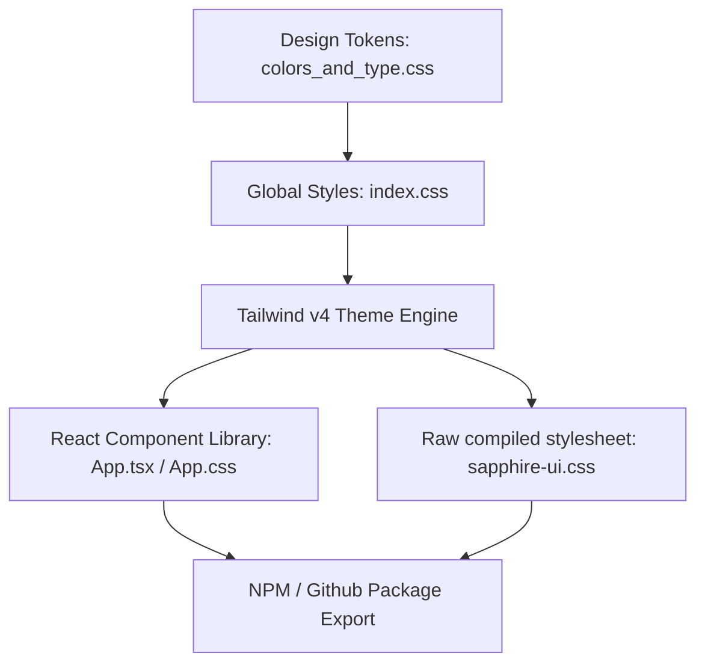

# Sapphire UI — Design System Spec & Components

Sapphire UI is the official, editorial-focused design system for **KONGMY Digital Solutions** (`kongmy.dev`). Grounded in deep navy authority and crisp gold accents, it is engineered to be a ruthlessly efficient, zero-bloat specimen tailored for professional IT consultancies, technical blogs (such as `blog.kongmy.dev`), and high-performance Web tools.

📖 **Live docs & interactive specimen:** [design.kongmy.dev](https://design.kongmy.dev)

---

## 🎨 Architectural Design System

Sapphire UI operates on a **dual-export architecture**, allowing it to be consumed as either an independent stylesheet (for HTML, Astro, and web products) or a strict typed React component library.



### 1. Unified Brand Tokens
- **Primary Navy (`#0a192f`)**: Dominates headers, structural components, and deep dark regions.
- **Accent Gold (`#c5a065`)**: Reserved strictly for interactive calls to action, highlights, active lists, and thin dividers.
- **Surface Off-White (`#f4f6f8`)**: Provides clean, readable page bases that mirror professional print publications.
- **Editorial Typography**: Interplays `Newsreader` (Georgia-fallback serif for headings) with `Source Sans 3` (system-ui fallback sans-serif for UI copy) and `JetBrains Mono` (technical scripts).

---

## 🚀 Local Development

This project is built using **Vite**, **TypeScript**, and **Tailwind CSS v4**, and is managed with **Bun**.

### Scripts & Commands

| Command | Action |
|:---|:---|
| `bun install` | Clean, cached installation of dependencies. |
| `bun run dev` | Runs the interactive specimen viewer locally at `http://localhost:5173/`. |
| `bun run build` | Compiles type declarations, bundle outputs, and minified CSS variables to `dist/`. |
| `bun run lint` | Triggers ESLint validation against workspace source files. |
| `bun run preview` | Spins up a local web server to preview production builds. |

---

## 📦 Consuming Sapphire UI

You can install Sapphire UI directly from GitHub Packages:

```bash
bun add @kongmy-dev/sapphire-ui
```

To consume the styles globally in your application:

```typescript
import '@kongmy-dev/sapphire-ui/style.css';
```

---

## 🔗 CI/CD & Automated Publishing

Every merge or push to `master` triggers our automated GitHub Actions workflow (`.github/workflows/publish.yml`), which features:

1. **Dual-Registry Publishing**: Publishes to both **GitHub Packages** (scoped `@kongmy-dev`) and the **public npm registry** in a single run.
2. **Node.js 24 Execution**: Explicitly configured via the `FORCE_JAVASCRIPT_ACTIONS_TO_NODE24` flag to utilize modern runtime performance.
3. **Advanced Caching**: Caches global Bun dependency trees (`~/.bun/install/cache`), checking against hashes of `bun.lock` for lightning-fast incremental pipelines.
4. **Tag-Based Deduplication**: Reads `version` from `package.json`, checks for an existing git tag, and skips the entire publish pipeline if the version has already been released.
5. **GitHub Releases**: Automatically creates a tagged GitHub Release with auto-generated release notes.

> **Required Secrets**: `NPM_TOKEN` — an npm access token with publish permissions. `GITHUB_TOKEN` is provided automatically.

---

## 🏛️ Interactive Design Catalog Specimen

When running the local environment (`bun run dev`), the default landing page hosts a premium, interactive spec specimen designed to aid product managers and front-end engineers:

- **Color Swatch Copier**: Click any visual color cell to automatically copy its exact Hex representation or CSS variable directly to your clipboard (with modern, custom floating toast alerts).
- **Typography Playground**: Enter any trial sentences inside our custom text box, and watch all serif headings, sans-serif body sizes, tracking tags, and monospace snippets re-render in real-time.
- **Component Register**: Showcases interactive primary, outline, ghost buttons, custom on-dark UI variants, pill badges, and structured product layout cards.

---

## 🤖 Custom AI Skill — Adopting the Design System

The repository ships a machine-readable design spec at [`design/design.md`](design/design.md). AI coding assistants — Gemini, GitHub Copilot, Claude, Cursor, or any tool that supports custom skills / instructions — can reference this file to generate UI code that stays on-brand automatically.

### Why a Custom Skill?

Without explicit design context, AI tools default to generic palettes, system fonts, and arbitrary spacing. A custom skill feeds the design tokens, typography scale, component patterns, and do's/don'ts directly into the model's context, producing code that matches the Sapphire UI system on the first attempt.

### Quick Setup (Gemini / Antigravity)

Create a skill folder in your global or project config:

```
.gemini/
  config/
    plugins/
      sapphire-ui-plugin/
        skills/
          sapphire-design/
            SKILL.md
```

**`SKILL.md`** — minimal example:

```markdown
---
name: sapphire-design
description: >
  Enforces the Sapphire UI design system (navy + gold, editorial typography,
  anti-bloat layout) when generating or modifying front-end code.
---

# Sapphire UI Design Skill

When generating HTML, CSS, React, or Astro code for any KONGMY project,
follow the design tokens and component specifications defined in the
Sapphire UI design system.

## Design Spec Reference

Read the full token specification from the repository:

- **Tokens & Spec:** `design/design.md`
- **CSS Variables:** `design/colors_and_type.css`
- **Live Catalog:** [design.kongmy.dev](https://design.kongmy.dev)

## Key Rules

1. **Colors** — Use `--color-primary` (#0a192f), `--color-accent` (#c5a065),
   `--color-surface` (#f4f6f8). No gradients in primary UI.
2. **Typography** — Headings: `Newsreader`. Body: `Source Sans 3`.
   Code: `JetBrains Mono`. Icons: `Material Symbols Outlined`.
3. **Spacing** — 4px base grid. Section padding: `--space-24` (96px) on desktop.
4. **Shapes** — Cards: 8px radius. Buttons: 6px. Tags/badges: pill (9999px).
5. **Elevation** — Background-color contrast, not heavy shadows. Hover lift:
   `translateY(-2px)` with a crisp card shadow.
6. **Voice** — First-person singular. No emoji, no exclamation marks.
```

### Quick Setup (Other AI Tools)

For tools that support project-level instructions (`.github/copilot-instructions.md`, `.cursorrules`, `.claude/instructions.md`, etc.), add the same core rules:

```markdown
# Sapphire UI Design System

When generating front-end code for this project, follow these design tokens:

- Primary: #0a192f (navy) — headers, structural components
- Accent: #c5a065 (gold) — CTAs, highlights, interactive elements
- Surface: #f4f6f8 (off-white) — page backgrounds
- Headings: Newsreader (serif) | Body: Source Sans 3 | Code: JetBrains Mono
- Cards: 8px radius, 1px border, 32px padding
- Buttons: 6px radius, 12px 24px padding
- No gradients in primary UI. No heavy drop shadows.
- See `design/design.md` for the complete specification.
```

### Consuming in Your Own Project

If you're building a new project on the Sapphire design language:

```bash
# 1. Install the package
bun add @kongmy-dev/sapphire-ui

# 2. Import the stylesheet (includes all design tokens as CSS variables)
import '@kongmy-dev/sapphire-ui/style.css';

# 3. Import components as needed
import { Button, Card, Badge } from '@kongmy-dev/sapphire-ui';
```

The stylesheet exports all design tokens as CSS custom properties (`--color-primary`, `--font-serif`, `--space-6`, etc.), so even non-React projects can consume the system by importing the CSS and applying the variables.

---

## ⚖️ License

Sapphire UI is open-source software licensed under the **[BSD 3-Clause License](LICENSE)**. Copyright © 2026 KONGMY Digital Solutions.


