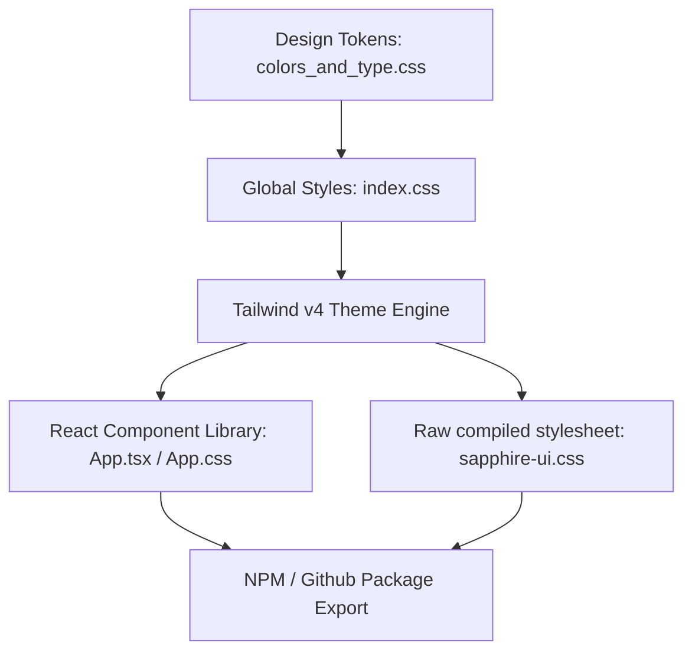

# Sapphire UI — Design System Spec & Components

Sapphire UI is the official, editorial-focused design system for **KONGMY Digital Solutions** (`kongmy.dev`). Grounded in deep navy authority and crisp gold accents, it is engineered to be a ruthlessly efficient, zero-bloat specimen tailored for professional IT consultancies, technical blogs (such as `paimon-techblog`), and high-performance Web tools.

---

## 🎨 Architectural Design System

Sapphire UI operates on a **dual-export architecture**, allowing it to be consumed as either an independent stylesheet (for HTML, Astro, and web products) or a strict typed React component library.



### 1. Unified Brand Tokens
- **Primary Navy (`#0a192f`)**: Dominates headers, structural components, and deep dark regions.
- **Accent Gold (`#c5a065`)**: Reserved strictly for interactive calls to action, highlights, active lists, and thin dividers.
- **Surface Off-White (`#f4f6f8`)**: Provides clean, readable page bases that mirror professional print publications.
- **Editorial Typography**: Interplays `Newsreader` (Georgia-fallback serif for headings) with `Source Sans 3` (system-ui fallback sans-serif for UI copy) and `JetBrains Mono` (technical scripts).

---

## 🚀 Local Development

This project is built using **Vite**, **TypeScript**, and **Tailwind CSS v4**, and is managed with **Bun**.

### Scripts & Commands

| Command | Action |
|:---|:---|
| `bun install` | Clean, cached installation of dependencies. |
| `bun run dev` | Runs the interactive specimen viewer locally at `http://localhost:5173/`. |
| `bun run build` | Compiles type declarations, bundle outputs, and minified CSS variables to `dist/`. |
| `bun run lint` | Triggers ESLint validation against workspace source files. |
| `bun run preview` | Spins up a local web server to preview production builds. |

---

## 📦 Consuming Sapphire UI

You can install Sapphire UI directly from GitHub Packages:

```bash
bun add @kongmy-dev/sapphire-ui
```

To consume the styles globally in your application:

```typescript
import '@kongmy-dev/sapphire-ui/style.css';
```

---

## 🔗 CI/CD & Automated Publishing

Every merge or push to `master` triggers our automated GitHub Actions workflow (`.github/workflows/publish.yml`), which features:

1. **GitHub Package Registry**: Builds and publishes minified packages directly to GitHub Packages.
2. **Node.js 24 Execution**: Explicitly configured via the `FORCE_JAVASCRIPT_ACTIONS_TO_NODE24` flag to utilize modern runtime performance.
3. **Advanced Caching**: Caches global Bun dependency trees (`~/.bun/install/cache`), checking against hashes of `bun.lock` for lightning-fast incremental pipelines.
4. **Publish Workaround**: Employs `npm publish` in its final step to bypass known Bun/GitHub tarball attachment issues, ensuring bulletproof deployments.

---

## 🏛️ Interactive Design Catalog Specimen

When running the local environment (`bun run dev`), the default landing page hosts a premium, interactive spec specimen designed to aid product managers and front-end engineers:

- **Color Swatch Copier**: Click any visual color cell to automatically copy its exact Hex representation or CSS variable directly to your clipboard (with modern, custom floating toast alerts).
- **Typography Playground**: Enter any trial sentences inside our custom text box, and watch all serif headings, sans-serif body sizes, tracking tags, and monospace snippets re-render in real-time.
- **Component Register**: Showcases interactive primary, outline, ghost buttons, custom on-dark UI variants, pill badges, and structured product layout cards.
